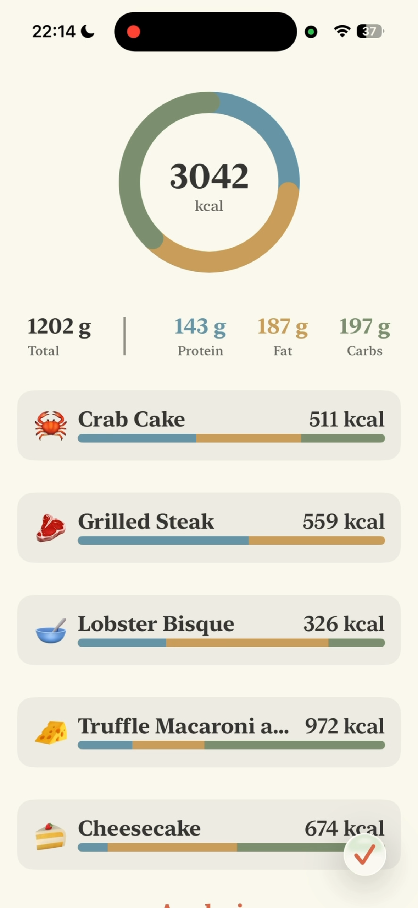
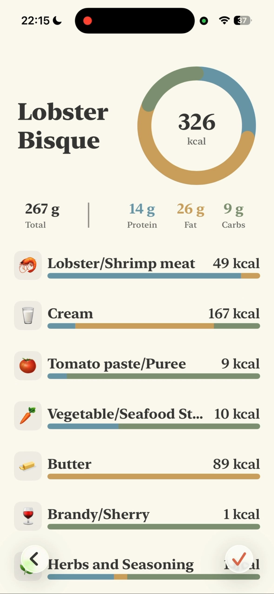
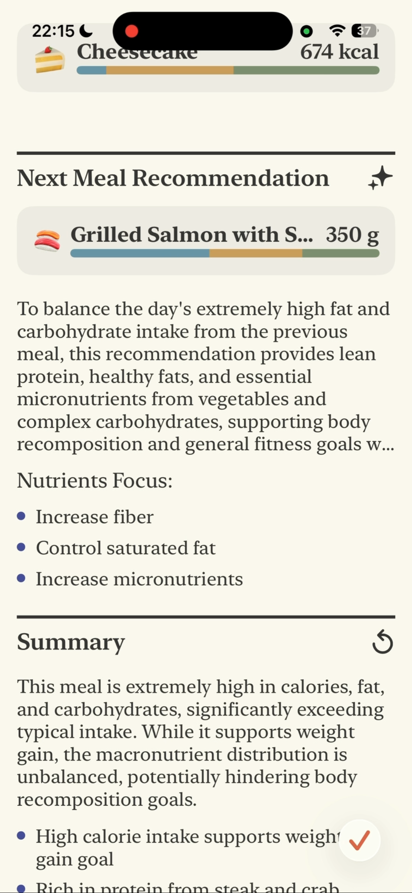

<div align="center">


<br/>

# Dietelligence

AI-powered nutrition companion for smarter eating decisions


</div>

## Overview

Dietelligence combines advanced AI with professional nutrition science to help you make informed dietary decisions. Simply snap a photo of your meal, and the app provides detailed nutritional analysis, personalized recommendations, and tracks your progress toward health goals.

## Screenshots

<div align="center">
  
  
  
</div>

<div align="center">
  <sub><b>Multi-Dish Analysis</b> • <b>Ingredient Breakdown</b> • <b>AI Recommendations</b></sub>
</div>

<br/>

## Features

### 📸 Smart Food Recognition
- **Instant Analysis** - Take a photo and get detailed nutritional breakdown within seconds
- **Multi-Dish Detection** - Analyzes multiple dishes in a single image
- **Ingredient-Level Breakdown** - View individual ingredients with weight and macros
- **Automatic Calculations** - Precise calorie and macronutrient computations

### 🎯 Personalized Nutrition Planning
- **TDEE Calculation** - Uses Mifflin-St Jeor equation for accurate daily calorie needs
- **Goal-Based Targets** - Customized plans for building muscle, losing fat, or maintaining weight
- **Activity Levels** - Six tiers from sedentary to extra active
- **Macro Ranges** - Min/max/target ranges for protein, carbs, and fats
- **Smart Adjustments** - Targets auto-regenerate when profile changes

### 🧠 AI-Powered Dietary Advice
- **Context-Aware Recommendations** - Considers your 3-day nutrition history
- **Meal Evaluation** - Detailed pros and cons of each meal
- **Next Meal Suggestions** - Specific dish recommendations with macro targets
- **Nutrient Focus** - Identifies which nutrients to prioritize

### 📊 Progress Tracking & History
- **Automatic Logging** - Meals saved with timestamp and meal type detection
- **Visual Analytics** - Circular nutrition rings and progress bars
- **3-Day Trends** - View average intake over recent days
- **Photo Archive** - Browse your complete meal history with images

### 🏆 Achievement System
- **Single Day Trophy** - Meet all nutrition targets for one day
- **3-Day Streak** - Maintain goals for 3 consecutive days
- **7-Day Streak** - Achieve a full week of balanced nutrition
- **Automatic Detection** - Trophies awarded after each meal save
- **Statistics Snapshots** - View nutrition stats for each achievement

### 👤 Comprehensive User Profile
- **Personal Metrics** - Age, gender, weight, height with BMI calculation
- **Dietary Preferences** - Track food preferences and restrictions
- **Health Notes** - Document allergies, injuries, or special considerations
- **Goal Selection** - 9 health goals including muscle building, fat loss, maintenance

## Tech Stack

### Platform & Frameworks
- **iOS**: Native SwiftUI for modern, responsive UI
- **SwiftData**: Type-safe persistence with three separate databases
- **AVFoundation**: Camera integration with live preview

### AI & Networking
- **Gemini API**: Three specialized services powered by Gemini 3 Flash Preview
  - Food Image Analyzer (temp: 0.2 for precision)
  - Dietary Advisor (temp: 0.3 for balanced advice)
  - Nutrition Planner (temp: 0.5 for creative meal suggestions)
- **Structured Output**: JSON schema-based responses for reliability
- **Resumable Upload**: Efficient image upload protocol

### Architecture & Patterns
- **MVVM**: Model-View-ViewModel for clean separation of concerns
- **UDF**: Unidirectional Data Flow for predictable state management
- **Service Layer**: Singleton managers for cross-cutting concerns
- **Repository Pattern**: Abstracted data persistence layer

### Security & Storage
- **iOS Keychain**: Secure API key storage via KeychainManager
- **Data Isolation**: Separate databases for user profiles, meals, and trophies
- **No Hardcoded Secrets**: All credentials stored securely

## Project Structure

```
Dietelligence/
├── App/                          # App entry point and onboarding
│   ├── DietelligenceApp.swift   # Main app with AppState
│   └── OnboardingFlowView.swift # User onboarding flow
├── Core/                         # Core business logic
│   ├── Models/                   # Domain models
│   │   ├── Dish.swift
│   │   ├── FoodIngredient.swift
│   │   ├── NutritionSummaryData.swift
│   │   ├── NutritionTargets.swift
│   │   ├── Trophy.swift
│   │   └── Persistence/          # SwiftData entities
│   ├── Services/                 # Business services
│   │   ├── Gemini/              # AI integration (3 services)
│   │   ├── Camera/              # Camera functionality
│   │   ├── MealPersistence/     # Meal storage
│   │   ├── Trophy/              # Achievement system
│   │   └── UserProfile/         # Profile management
│   └── Utils/                    # Utilities
├── Features/                     # Feature modules
│   ├── Analysis/                # Food analysis flow
│   ├── Camera/                  # Camera capture
│   ├── History/                 # Meal history
│   ├── Trophy/                  # Trophy display
│   └── UserProfile/             # User settings
├── Shared/                      # Reusable UI components
│   └── Components/              # 12+ shared views
└── Assets.xcassets/             # Assets and colors
```

## How It Works

### Food Recognition Pipeline
1. **Capture** - Take photo with live camera preview
2. **Optimize** - Resize and compress image (max 1024x1024)
3. **Upload** - Send to Gemini File API with resumable upload
4. **Analyze** - AI identifies dishes and ingredients with nutritional data
5. **Transform** - Convert API response to UI models
6. **Advise** - Generate personalized recommendations based on user profile
7. **Save** - Store meal with photo and advice in SwiftData

### Nutrition Calculation
- **TDEE Formula**: Mifflin-St Jeor equation for basal metabolic rate
- **Activity Multipliers**: 1.2 (sedentary) to 1.9 (extra active)
- **Goal Adjustments**:
  - Lose Fat: -15% to -20% calorie deficit
  - Build Muscle: +10% to +15% calorie surplus
  - Maintain: ±5% maintenance range
- **Macro Distribution**: Protein, carbs, fats with min/max/target values

### Trophy Detection
- Runs automatically after each meal save
- Checks on app startup for missed achievements
- Compares daily totals against nutrition targets
- Awards trophies with nutrition statistics snapshot

## Development

### Prerequisites
- Xcode 15.0+
- iOS 17.0+
- Gemini API key

### Setup
1. Clone the repository
2. Open `Dietelligence.xcodeproj` in Xcode
3. Add your Gemini API key to iOS Keychain (handled by app on first run)
4. Build and run on iOS simulator or device

### Testing
- **13 Test Files** - Comprehensive unit and integration tests
- **Test Coverage** - Models, services, persistence, API integration
- **Test Helpers** - SwiftData test utilities for isolated testing
- **Run Tests**: `cmd+U` in Xcode or use `Dietelligence.xctestplan`

### Code Quality
- Type-safe SwiftData persistence
- Async/await for all network operations
- Error handling with user-friendly retry mechanisms
- Image optimization to reduce upload time
- Modular architecture for maintainability

## Key Components

### Domain Models
- **Dish**: Container for multiple food ingredients
- **FoodIngredient**: Individual ingredient with macros (protein, fat, carbs)
- **NutritionTargets**: Daily goals with min/max ranges
- **Trophy**: Achievement with type, date, and stats
- **UserNutritionProfile**: Complete user data and preferences

### Core Services
- **GeminiFoodImageAnalyzer**: Food recognition and nutritional analysis
- **GeminiDietaryAdvisor**: Context-aware meal recommendations
- **GeminiNutritionPlanner**: TDEE and macro target calculations
- **MealPersistenceManager**: Meal history storage and queries
- **TrophyManager**: Achievement detection and storage
- **UserProfileManager**: Profile CRUD and target generation
- **KeychainManager**: Secure credential storage

### UI Highlights
- **NutritionRingView**: Circular macro visualization
- **AnalysisResultView**: Complete analysis display
- **DishDetailView**: Ingredient breakdown with progress bars
- **TrophyHistoryView**: Achievement gallery
- **OnboardingFlowView**: Welcome and profile setup

## Database Schema

Three separate SwiftData databases:
- **default.store**: User profiles and nutrition targets
- **MealHistory.sqlite**: Meals with photos and dishes
- **Trophies.sqlite**: Achievements with statistics

## Privacy & Security
- API keys stored in iOS Keychain
- Photos saved locally, not uploaded to cloud
- No user data sharing with third parties
- Gemini API used only for food analysis
